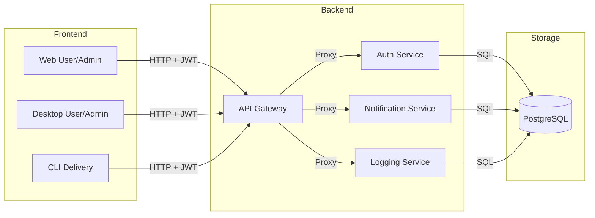

<!--
  @file README.md
  @brief Root workspace documentation for rz-gallery.
  @author ZHENG Robert
  @date 2026-03-22
  @version 1.0.0
-->

# rz-gallery

A distributed microservices photo gallery system with high-performance C++23 backends and multi-platform clients.

## Architecture

### Bounded Context

The **rz-gallery** workspace encompasses the entire photo lifecycle: ingestion, storage, metadata management, security (RBAC), and delivery across web, desktop, and CLI platforms. The core boundaries are defined between the stateless backend services and the platform-specific frontend clients.

### Ecosystem Overview

| Component    | Responsibility                                                                 |
| ------------ | ------------------------------------------------------------------------------ |
| **Backend**  | Secure API Gateway, Identity Provider (JWT), Event Logging, and Notifications. |
| **Frontend** | User/Admin apps for Web and Desktop, plus specialized CLI delivery tools.      |
| **Database** | Shared PostgreSQL store for all persistent system data.                        |

### System Diagram

## Documentation

- Detailed specifications are located in the `docs/` directory (**rz-gallery-docs** repo).

## License

Apache-2.0 - Copyright (c) 2026 ZHENG Robert
