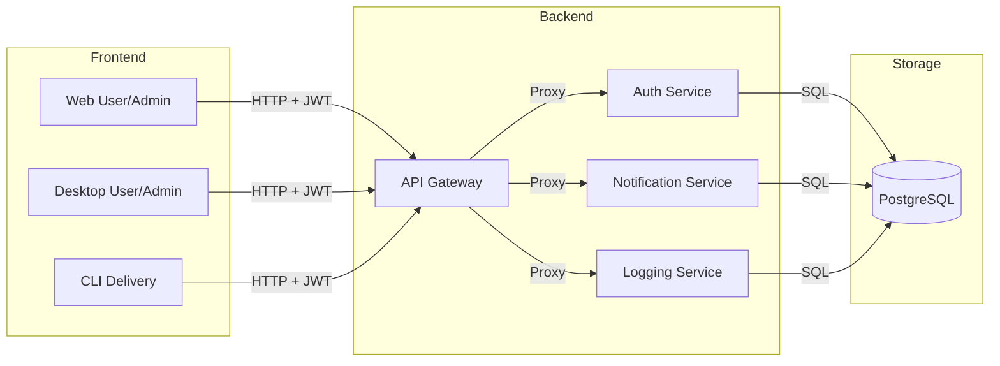

<!--
  @file README.md
  @brief Root workspace documentation for rz-gallery.
  @author ZHENG Robert
  @date 2026-03-22
  @version 1.0.0
-->

# rz-gallery

A distributed microservices photo gallery system with high-performance C++23 backends and multi-platform clients.

---

<!-- START doctoc generated TOC please keep comment here to allow auto update -->
<!-- DON'T EDIT THIS SECTION, INSTEAD RE-RUN doctoc TO UPDATE -->

**Table of Contents**

<!-- END doctoc generated TOC please keep comment here to allow auto update -->

---

## Description

RZ-Gallery is a distributed, modular photo gallery system built with modern C++23
microservices, a central API gateway, shared libraries, and a PostgreSQL database.

This repository contains the **architecture documentation**, **C4 diagrams**, and
**cross-service specifications** for the entire system.

## Architecture Overview

### Bounded Context

The **rz-gallery** workspace encompasses the entire photo lifecycle: ingestion, storage, metadata management, security (RBAC), and delivery across web, desktop, and CLI platforms. The core boundaries are defined between the stateless backend services and the platform-specific frontend clients.

### Ecosystem Overview

| Component    | Responsibility                                                                 |
| ------------ | ------------------------------------------------------------------------------ |
| **Backend**  | Secure API Gateway, Identity Provider (JWT), Event Logging, and Notifications. |
| **Frontend** | User/Admin apps for Web and Desktop, plus specialized CLI delivery tools.      |
| **Database** | Shared PostgreSQL store for all persistent system data.                        |

### System Diagram

## 🧩 Microservices

The system currently includes:

- **API Gateway** (`rz-gallery_api-gw`)
- **Auth Service** (`rz-gallery_auth`)
- **Notification Service** (`rz-gallery_notification`)
- **Logging Service** (`rz-gallery_logging`)
- **Shared Library** (`rz-gallery_libs-common`)
- **Database Schema** (`rz-gallery_db`)

### Repositories

| Component | Repository                                                                    | Description                                       |
| --------- | ----------------------------------------------------------------------------- | ------------------------------------------------- |
| Overall   | [Documentation](https://github.com/Zheng-Bote/rz-gallery_docs)                | Documentation for rz-gallery.                     |
| Backend   | [API Gateway](https://github.com/Zheng-Bote/rz-gallery_api-gw)                | API Gateway and Dispatcher for the RZ-Gallery.    |
| Backend   | [Shared Library](https://github.com/Zheng-Bote/rz-gallery_libs-common)        | Common libraries for rz-gallery backend services. |
| Backend   | [Database Schema](https://github.com/Zheng-Bote/rz-gallery_db)                | Database for rz-gallery.                          |
| Backend   | [Notification Service](https://github.com/Zheng-Bote/rz-gallery_notification) | Notification service for rz-gallery.              |
| Backend   | [Logging Service](https://github.com/Zheng-Bote/rz-gallery_logging)           | Logging service for rz-gallery.                   |
| Backend   | [auAuth Serviceth](https://github.com/Zheng-Bote/rz-gallery_auth)             | Authentication service for rz-gallery.            |

### Future services

- Upload Service
- Metadata Service
- Image Processing Service

## 🚀 Goals

- Modular, maintainable architecture
- Clear service boundaries
- Consistent communication patterns
- Scalable deployment model
- Strong documentation for onboarding and development

---

## 📜 License

This project is licensed under the **Apache-2.0 License** - see the [LICENSE](LICENSE) file for details

Copyright (c) 2026 ZHENG Robert

## 🤝 Authors

- 

### Code Contributors

---

Made with ❤️ and a lot of sugar. :vulcan_salute:
